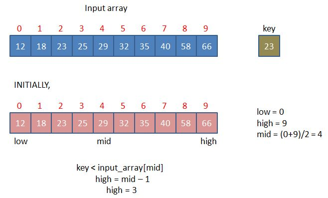
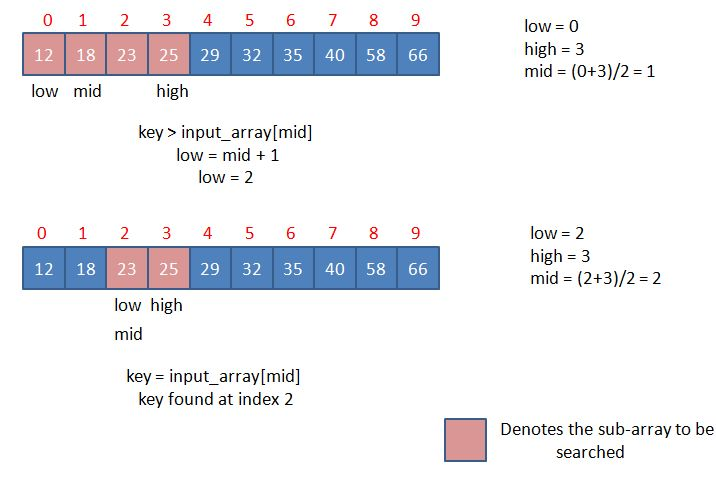

# Binary-search-project
# Project features
- Binary search over an user defined array.
- Array must be sorted by user.
- Number of vaules is variable and determined by the user.
- Handling input errors like - or 0 as input in array size.
# Language Used: 
- x86 assembly language
# Binary-search
Binary Search is a searching algorithm used in a sorted array by repeatedly dividing the search interval in half.
The idea of binary search is to use the information that the array is sorted and reduce the time complexity to O(Log n). 
## Advantages:
- It eliminates half of the list from further searching by using the result of each comparison.
- It indicates whether the element being searched is before or after the current position in the list.
- This information is used to narrow the search.
- For large lists of data, it works significantly better than linear search.
# Complexity of Binary search algorithm
- Time complexity - O(log nlogn)
- Space complexity - O(1)
# Binary-Search algorithm

# Example
Let input_array = {12, 18, 23, 25, 29, 32, 35, 40, 58, 66}

## Project Tools:
- emu8086
## Bugs we faced
- Input size was taking from 0 to 9 only (one digit)
- '-' or '+' signs was taken as array size without prompting errors.
-
